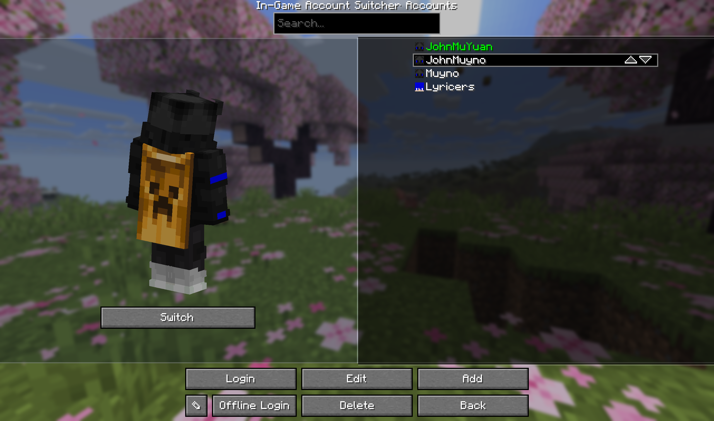
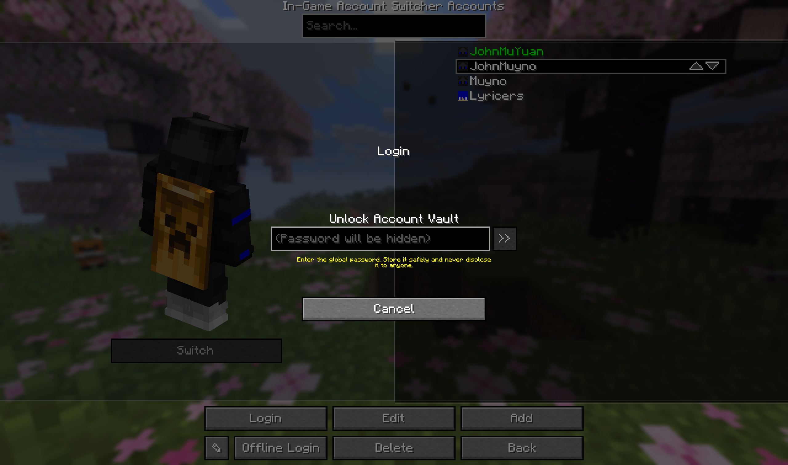
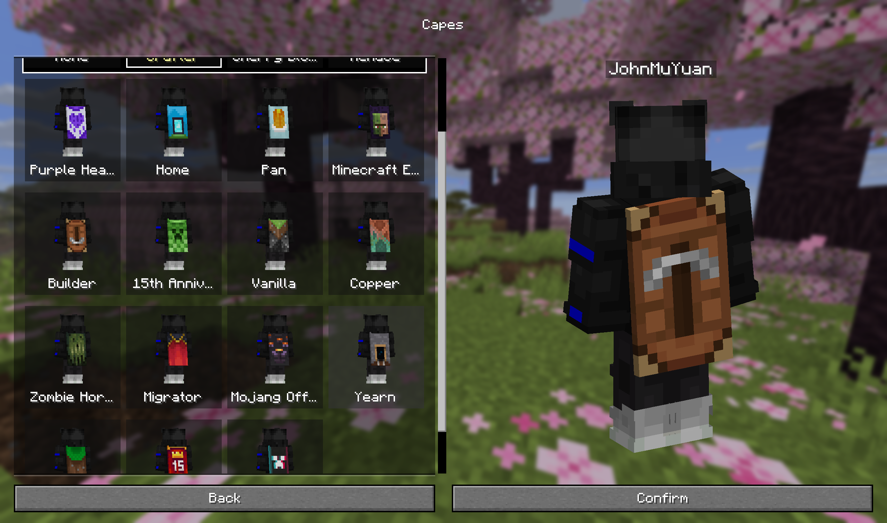
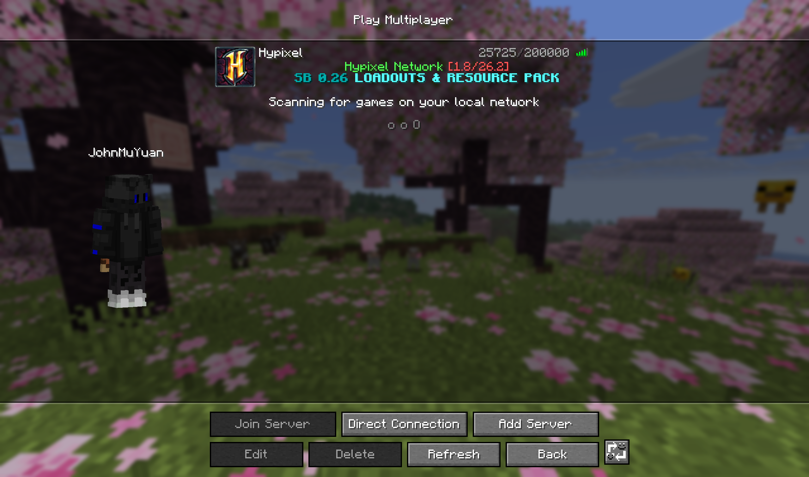
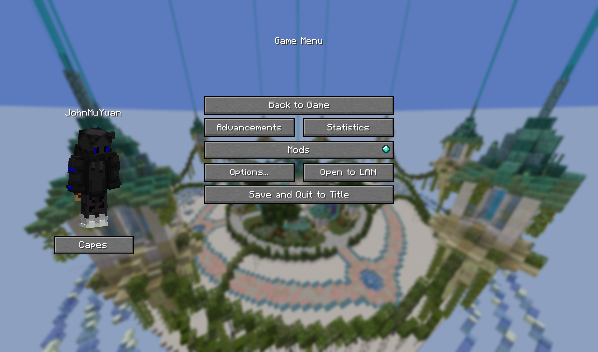

# In-Game Account Switcher: JohnMuyuan Edited Version

**English** | [简体中文](README_zh-CN.md)


Change your logged-in Minecraft account in-game without restarting Minecraft. This unofficial edition, maintained by JohnMuyuan, adds several features and improves the account-switching experience.

This repository is an unofficial third-party modification of [In-Game Account Switcher](https://github.com/The-Fireplace-Minecraft-Mods/In-Game-Account-Switcher). It is not an official upstream release. The original authorship, contributor credits, and LGPL-3.0-or-later licensing notices are retained.

## Supported builds

The following targets have been built and verified:

| Loader | Minecraft | Java | Additional requirements |
| --- | --- | --- | --- |
| Fabric | `1.20.1` | Java 17 | Fabric Loader `0.19.1+` and Fabric API; Mod Menu is optional |
| Fabric | `26.1.2` | Java 25 | Fabric Loader `0.19.1+` and Fabric API; Mod Menu is optional |
| Fabric | `26.2` | Java 25 | Fabric Loader `0.19.1+` and Fabric API; Mod Menu is optional |
| Forge | `1.20.1` | Java 17 | Forge `47.3.19` to `<48` |
| Forge | `26.1.2` | Java 25 | Forge `64.x` |
| Forge | `26.2` | Java 25 | Forge `65.x` |

NeoForge, Quilt, and combinations not listed above are not supported by this edited version.

## Notable changes

- Redesigned the title-screen and in-game account-switcher interfaces with a two-column layout.
- Improved account-list layout, button placement, window scaling, and adaptive skin previews.
- Added mouse-drag character rotation and preserved preview poses when opening secondary screens.
- Improved skin and cape preloading, caching, selection state, and refresh behavior.
- Replaced per-account passwords with one global password protecting all saved Microsoft accounts.
- Added safe global-password changes for an unlocked vault, with recovery attempts if the operation is interrupted.
- Removed the upstream remote-disable connection.
- Hardened the local OAuth callback server and removed sensitive authentication response data from error logs.

## Screenshots

### Screenshot 1


### Screenshot 2



### Screenshot 3



### Screenshot 4



### Screenshot 5



### Screenshot 6



## Installation

1. Install a supported Minecraft version and its matching loader. Fabric builds also require Fabric API.
2. Remove the original In-Game Account Switcher from the `mods` directory if it is installed.
3. Place the JAR matching your Minecraft version and loader in the `mods` directory.

This edition retains the mod ID `ias`, so it cannot be installed alongside the original IAS mod.

## Building from source

Use the included Gradle Wrapper. Run Gradle itself with JDK 25. Building a Minecraft 1.20.1 target also requires an existing JDK 17 toolchain on the machine.

Windows example:

```powershell
$env:JAVA_HOME = "C:\path\to\jdk-25"
./gradlew.bat --no-daemon "-Dru.vidtu.ias.only=26.2-fabric" :26.2-fabric:clean :26.2-fabric:check :26.2-fabric:assemble
```

Linux/macOS example:

```bash
JAVA_HOME=/path/to/jdk-25 ./gradlew --no-daemon \
  -Dru.vidtu.ias.only=26.2-fabric \
  :26.2-fabric:clean :26.2-fabric:check :26.2-fabric:assemble
```

Replace `26.2-fabric` with any target from the supported-builds table. Release JARs are written to:

```text
build/libs/IAS-9.0.7-johnmuyuan.1+<minecraft>-<loader>.jar
```

A first build requires network access to obtain Minecraft, loader, and build dependencies. Offline mode works only when all required dependencies are already cached.

## Account-vault security

When a Microsoft account is saved for the first time, the mod asks you to create a global password. It must be longer than 16 characters and contain uppercase letters, lowercase letters, digits, and special characters. Do not reuse your Microsoft account password or share the global password with anyone.

The global password protects account files stored on disk. It increases the cost of recovering tokens from copied or leaked vault files, but it cannot protect against malware that already controls the computer or can read process memory, keyboard input, or screen contents. The unlocked password is kept only in memory for the current game process and is not written to the account files in plaintext.

The global password cannot be recovered. If it is forgotten, delete the vault and saved account data, then add the accounts again. See [docs/CRYPT.md](docs/CRYPT.md) for the storage format, algorithms, file locations, and threat model.

**Never share the `_IAS_ACCOUNTS_DO_NOT_SEND_TO_ANYONE` directory from your game folder, even if it appears empty. Do not publish unredacted game logs.**

## License and credits

This project is distributed under the [GNU Lesser General Public License v3.0 or later](LICENSE).

- Original author: VidTu
- Edited-version author: JohnMuyuan
- Original-project and contributor credits are retained in the mod metadata and source headers
- The modifications in this edited version were made by JohnMuyuan in 2026
- The edited icon is based on the original project icon and was modified with generative-AI assistance; the original and edited versions are provided with this project under LGPL-3.0-or-later

Minecraft is a trademark of Mojang Studios. This project is not affiliated with Mojang Studios or Microsoft.
